This doc describes Indoor Routing, including how you can customize it to work for your particular needs.

> **Looking for ArcGIS Indoors?** ArcGIS Indoors is Esri's solution for indoor mapping, location tracking, and wayfinding; no code required. [Learn more about ArcGIS Indoors](https://www.esri.com/en-us/arcgis/products/arcgis-indoors).

# Indoor Routing for Xamarin documentation

<!-- MDTOC maxdepth:6 firsth1:0 numbering:0 flatten:0 bullets:1 updateOnSave:1 -->

- [Description](#description)   
- [Preparing the data](#preparing-the-data)   
   - [Base data](#base-data)   
   - [Feature data](#feature-data)   
   - [Network data](#network-data)   
   - [Locators](#locators)   
- [App architecture](#app-architecture)   
- [The app in action](#the-app-in-action)   
   - [App settings](#app-settings)   
   - [Mobile map package download](#mobile-map-package-download)   
   - [Loading the map](#loading-the-map)   
   - [Navigating the map](#navigating-the-map)   
   - [Search functionality](#search-functionality)   
   - [Querying data](#querying-data)   
   - [Setting a home location](#setting-a-home-location)   
   - [Routing](#routing)   
   - [Using location services](#using-location-services)   
- [Adaptive layout](#adaptive-layout)   
- [Customize app appearance](#customize-app-appearance)   
- [Update assets](#update-assets)   

<!-- /MDTOC -->
---

## Description

This app enables you to find routes on a campus using custom building data, an indoor network, and locators. Indoor Routing includes a package with data for Esri's Redlands campus.

There are four primary ways you can customize this app with minimal code changes:

* [Change the data](#preparing-the-data) - this app references an item on ArcGIS Online. You can prepare an MMPK following a defined format to use this app with your campus or building.
* [Change the default settings](#app-settings) - *AppSettings.cs* defines default settings for various aspects of the application. You can change these defaults before publishing the app.
* [Change the app's appearance](#customize-app-appearance) - the iOS solution has a file named *ApplicationTheme.cs* that defines colors, materials, margins, and corner rounding, giving you one place to customize the app's appearance.
* [Change assets](#update-assets) - the iOS solution defines all UI text in *Localizable.strings*, so you can customize all language there, or provide translations in additional languages.. *Assets.xcassets* defines all images and symbols used in the application. You can change images or provide light/dark variation.

Indoor Routing for Xamarin is architected to support multiple platforms using the MVVM pattern. Currently only the iOS UI has been implemented, but you could extend this application to support multiple platforms while sharing most application logic.

## Preparing the data

A large portion of getting this application off the ground is gathering and preparing the data. The app uses a [mobile map package](https://pro.arcgis.com/en/pro-app/help/sharing/overview/mobile-map-package.htm) (`mmpk`) which contains all the needed base data, feature data, network data and locators.

### Base data

While base data is not needed for the application to run, it's good to have for visual appeal, so the buildings do not look like they're floating on a grid. Mobile Map Packages do not support including a [tile package](https://desktop.arcgis.com/en/arcmap/latest/map/working-with-arcmap/about-tile-packages.htm) (`tpk`) or an [online basemap](https://doc.arcgis.com/en/arcgis-online/create-maps/choose-basemap.htm). To add a basemap into the `mmpk`, a developer's best option is to create a [vector tile package](https://pro.arcgis.com/en/pro-app/help/sharing/overview/vector-tile-package.htm) (`vtpk`) of their base data and include it in the `mmpk`. If creating a `vtpk` is not a viable option, then the code can be modified to download a `tpk` to use as a basemap. Or, if the application is to be used in a connected environment, then adding an online basemap to the app might be the fastest and simplest option.

```csharp
// Sample code on how to add basemap to a map
// create a new (empty) map
var myMap = new Map();
// create a streets basemap
var streetsBasemap = Basemap.CreateStreets();
// add the basemap to the map
myMap.Basemap = streetsBasemap;
// add layers from the mmpk
...
```

### Feature data

In this app, the [feature](https://support.esri.com/en/other-resources/gis-dictionary/term/dcc335be-78ae-4bd2-b254-b44c37343f75) data represents building rooms and building walls data. They are included in the mmpk as [feature layers](https://support.esri.com/en/other-resources/gis-dictionary/term/740c847c-829e-409b-94dc-e217f0813cc4). In the application, these layers are referred to as Operational Layers and are used to display building information and run queries. Both the feature layers and the network data were created using the CAD to GIS set of tools developed by Esri's Professional Services group.

### Network data

A network dataset is used to generate the routes between offices. While this app was built to support only one network, it could be modified to accommodate multiple networks. For example, if buildings are far apart and users would need to drive and walk to get between offices, a second, road network could be added. Once the network data is created, it should be ready to be used in the app. However, [a set of tools](https://pro.arcgis.com/en/pro-app/tool-reference/network-analyst/an-overview-of-the-network-dataset-toolset.htm) in ArcGIS Pro can help with changes needed to be made to the network.

### Locators

Locators provide the ability to find a location based on an address (geocode). In the case of indoor data, the address is an office or an employee's name. To accommodate searching for both office number and employee name, two separate [single field locators](https://pro.arcgis.com/en/pro-app/help/data/geocoding/create-a-locator.htm) were created and then merged into a [composite locator](https://pro.arcgis.com/en/pro-app/help/data/geocoding/create-a-composite-locator.htm). The Composite Locator was then added to the mmpk.

## App architecture

The Indoor Routing is currently a Xamarin iOS app. The business logic is separate from the UI and is stored in a set of ViewModels in the shared part of the solution. This will make it relatively easy to add an Android or UWP UI to it later on. The native architecture was preferred over using Xamarin Forms due to stability concerns and the desire to have a native looking UI. For more information on Xamarin, including how to get started, please see [Microsoft's website](https://developer.xamarin.com/guides/cross-platform/getting_started/).

## The app in action

### App settings

Since this is a multi-platform application, the app settings are stored inside an xml that is created when the app is first installed and updated throughout the app's usage. AppSetting can be changed to include additional settings per developer requirements. Using the factory pattern, a static instance of CurrentSettings is made available throughout the application.

```csharp
internal static async Task<AppSettings> CreateAsync(string filePath)
{
    var appSettings = new AppSettings {
        PortalItemID = "52346d5fc4c348589f976b6a279ec3e6",
        PortalItemName = "RedlandsCampus.mmpk",
        // Set the room and walls layers
        RoomsLayerIndex = 1,
        FloorPlanLinesLayerIndex = 2,
        RoomsLayerFloorColumnName = "FLOOR",
        // Set fields displayed in the details card
        LocatorFields = new List<string> {"LONGNAME", "KNOWN_AS_N"},
        ContactCardDisplayFields = new List<string> {"LONGNAME", "KNOWN_AS_N"},
        // Change at what zoom levels the room data becomes visible
        RoomsLayerMinimumZoomLevel = 750,
        // Change map scale bounds
        MapViewMinScale = 100,
        MapViewMaxScale = 13000,
        MmpkDownloadDate = new DateTime(1900, 1, 1),
        HomeLocation = string.Empty,
        IsLocationServicesEnabled = false,
        IsRoutingEnabled = true,
        UseOnlineBasemap = false,
        IsPreferElevatorsEnabled = false,
        InitialViewpointCoordinates = new[]
        {
            new SerializableKeyValuePair<string, double>("X", -13046209),
            new SerializableKeyValuePair<string, double>("Y", 4036456),
            new SerializableKeyValuePair<string, double>("WKID", 3857),
            new SerializableKeyValuePair<string, double>("ZoomLevel", 13000),
        }
    };
    ...
    return appSettings;
}
```

### Mobile map package download

 When the app first starts, it checks to see if an mmpk has been downloaded, or if there's an updated version to be downloaded from Portal.

 ```csharp
 // Get portal item
var portal = await ArcGISPortal.CreateAsync().ConfigureAwait(false);
var item = await PortalItem.CreateAsync(portal, AppSettings.CurrentSettings.PortalItemID).ConfigureAwait(false);

// Test if mmpk is not already downloaded or is older than current portal version
if (!this.Files.Contains(this.TargetFileName) ||
    item.Modified.LocalDateTime > AppSettings.CurrentSettings.MmpkDownloadDate)
{
    this.IsDownloading = true;
    this.DownloadURL = item.Url.AbsoluteUri + "/data";
}
else
{
    this.IsReady = true;
}
 ```


If a download is needed, the app uses the iOS [NSUrlSessionDownloadTask](https://github.com/xamarin/ios-samples/blob/master/SimpleBackgroundTransfer/SimpleBackgroundTransfer/SimpleBackgroundTransferViewController.cs) to download the mmpk. This insures that the mmpk is downloaded even if the user switches away from the app during the download.

```csharp
// Create a new download task.
var downloadTask = this.session.CreateDownloadTask(NSUrl.FromString(downloadUrl));
```

Both the mmpk and the app settings files are stored on the device and once downloaded, the app can work in a fully disconnected environment.

### Loading the map

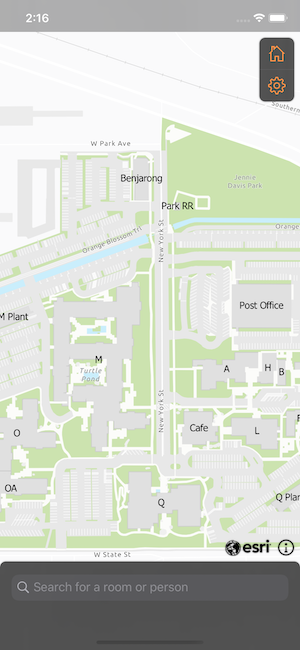

Once everything is downloaded, the mmpk and all of its contents are loaded inside the Initialize method of the Main View Model.

```csharp
internal async Task InitializeAsync()
{
    // Load mmpk from device and load it
    var mmpk = await this.LoadMMPKAsync().ConfigureAwait(false);

    // Display map from the mmpk. Assumption is made that the first map of the mmpk is the one used
    this.Map = mmpk.Maps.FirstOrDefault();
    await Map.LoadAsync().ConfigureAwait(false);

    // Set the locator to be used in the app
    var locator = mmpk.LocatorTask;
    await locator.LoadAsync().ConfigureAwait(false);

    // Create instance of the Location View Model
    if (LocationViewModel.Instance == null)
    {
        LocationViewModel.Instance = LocationViewModel.Create(Map, locator);
    }

    // Set viewpoint of the map depending on user's setting
    await this.SetInitialViewPointAsync().ConfigureAwait(false);
}
```

The Initial Viewpoint is the initial extent that the map is loaded to when the application starts. This extent is configured in the settings. If the initial extent is not set, the map will display the full extent of the mmpk.

### Navigating the map

There are three ways to move around the map: pan, zoom and floor change. The floor picker is displayed only when the map is zoomed in past a certain extent. This extent is also defined in the settings and can be easily changed. When the floor picker is activated, the app applies definition expressions on the rooms and walls layers to only display the selected floor.

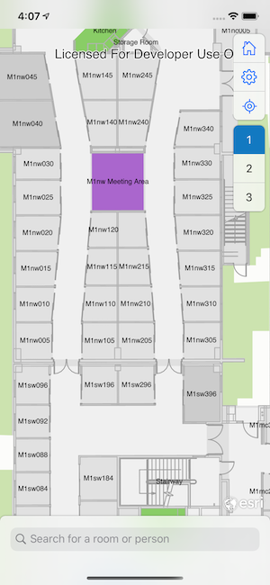

```csharp
foreach (var featureLayer in Map.OperationalLayers.OfType<FeatureLayer>())
{
    // Select the floor
    featureLayer.DefinitionExpression = $"{AppSettings.CurrentSettings.RoomsLayerFloorColumnName} = '{SelectedFloorLevel}'";

    // Ensure the layer is visible
    featureLayer.IsVisible = true;
}
```

### Search functionality

The mmpk locator is used to search for offices or employees. When user starts entering text, the locator is used to provide suggestions.

|Auto-complete office|Auto-complete name|
|---	|---	|
|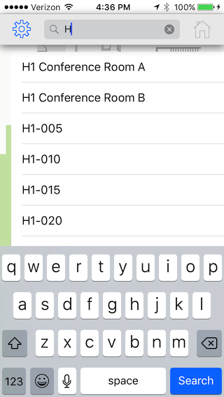|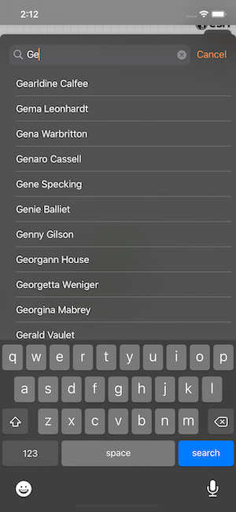|

```csharp
internal async Task<IReadOnlyList<SuggestResult>> GetLocationSuggestionsAsync(string userInput)
{
    var locatorInfo = this.Locator.LocatorInfo;

    if (locatorInfo.SupportsSuggestions)
    {
        // restrict the search to return no more than 10 suggestions
        var suggestParams = new SuggestParameters { MaxResults = 10 };

        // get suggestions for the text provided by the user
        var suggestions = await this.Locator.SuggestAsync(userInput, suggestParams);
        return suggestions;
    }
    return null;
}
```

When a suggestion is selected, the selection is then passed to the locator again, this time to retrieve the actual location

```csharp
internal async Task<GeocodeResult> GetSearchedLocationAsync(string searchString)
{
    // Geocode location and return the best match from the list
    var matches = await this.Locator.GeocodeAsync(searchString);
    var bestMatch = matches.FirstOrDefault();
    return bestMatch;
}
```

Several matches are returned, with corresponding accuracy scores. This app makes the assumption that the first match is the best, but it could be changed so users see more than one of the returned matches.
[Read more about locators](https://developers.arcgis.com/documentation/mapping-apis-and-location-services/search/geocoding/).

The resulting location is then added to the map inside a [graphics overlay](https://developers.arcgis.com/documentation/mapping-apis-and-location-services/maps/graphics/)

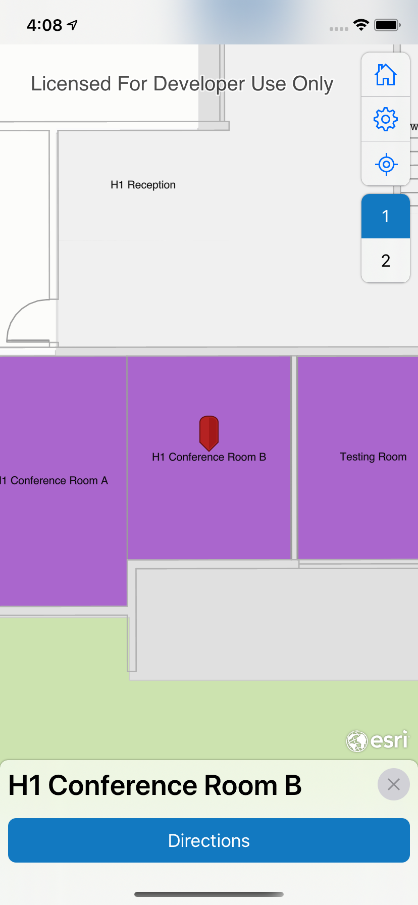

```csharp
if (geocodeResult != null)
{
    // create a picture marker symbol and offset it
    var uiImagePin = UIImage.FromBundle("MapPin");
    var mapPin = this.ImageToByteArray(uiImagePin);
    var roomMarker = new PictureMarkerSymbol(new RuntimeImage(mapPin));
    roomMarker.OffsetY = uiImagePin.Size.Height * 0.65;

    // Create graphic
    var mapPinGraphic = new Graphic(geocodeResult.DisplayLocation, roomMarker);

    // Add pin to map
    var graphicsOverlay = this.MapView.GraphicsOverlays["PinsGraphicsOverlay"];
    graphicsOverlay.Graphics.Clear();
    graphicsOverlay.Graphics.Add(mapPinGraphic);
    this.MapView.GraphicsOverlays["PinsGraphicsOverlay"].IsVisible = true;
}
```

### Querying data

The locator provides a map location for the searched feature, but does not provide any attribute data. To populate the card at the bottom of the map and select the appropriate floor, the data is queried

```csharp
// Run query to get attributes of the selected room
var roomsLayer = this.Map.OperationalLayers[AppSettings.CurrentSettings.RoomsLayerIndex] as FeatureLayer;

if (roomsLayer != null)
{
    // Get feature table to be queried
    var roomsTable = roomsLayer.FeatureTable;

    // Set query parameters
    var queryParams = new QueryParameters()
    {
        ReturnGeometry = true,
        WhereClause = string.Format(string.Join(" = '{0}' OR ", AppSettings.CurrentSettings.LocatorFields) + " = '{0}'", searchString)
    };

    // Query the feature table
    var queryResult = await roomsTable.QueryFeaturesAsync(queryParams);
        return queryResult.FirstOrDefault();
    }
}
```

### Setting a home location

The app offers the option to set a Home Location. This location is used to pre-populate the starting point of routes, and the user can easily get back Home by tapping the Home button to the right of the search bar. The same locator is used to generate the suggestions and retrieve the selected location. Once set, the Home location is written to the AppSettings file and persists between app sessions.

|Settings with home|Go to home|
|---	|---	|
|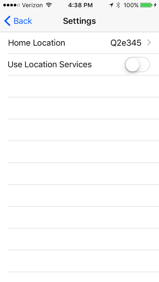|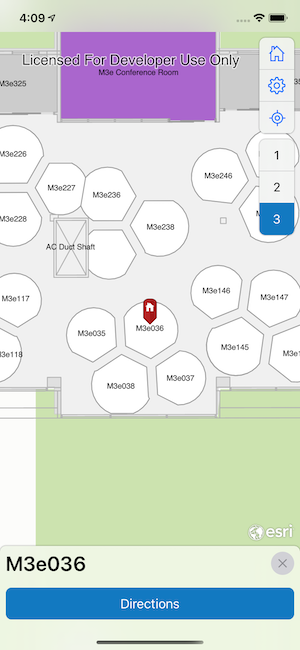|

### Routing

Once search is complete and a feature is selected on the map, the route icon appears on the bottom card. Tapping that navigates the app to the routing page, where user is prompted to add a Start and End location. The End location is always pre-populated with the feature selected on the map. The Start location is only pre-populated if Location Services is enabled or if the user has a Home Location set. When the user hits Route Me, the app navigates back to the map and the route is generated using the TransportationNetwork that was packaged in the mmpk. Read more about [routing and how to create routes using transportation networks](https://developers.arcgis.com/documentation/mapping-apis-and-location-services/routing/routing/).

```csharp
var routeTask = await RouteTask.CreateAsync(this.Map.TransportationNetworks[0]);

if (routeTask != null)
{
    // Get the default route parameters
    var routeParams = await routeTask.CreateDefaultParametersAsync();

    // Explicitly set values for some params
    // Indoor networks do not support turn by turn navigation
    routeParams.ReturnRoutes = true;
    routeParams.ReturnDirections = true;

    // Create stops
    var startPoint = new Stop(fromLocation);
    var endPoint = new Stop(toLocation);

    // assign the stops to the route parameters
    routeParams.SetStops(new List<Stop> { startPoint, endPoint });

    // Execute routing
    var routeResult = await routeTask.SolveRouteAsync(routeParams);

    return routeResult;
}
```

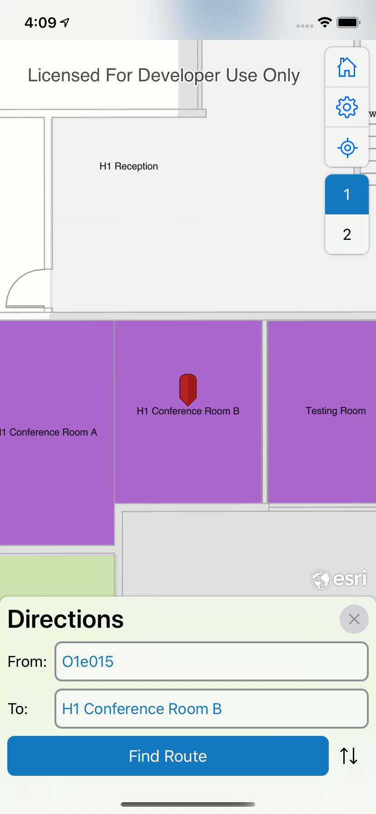

The route is then displayed on the map using a GraphicsOverlay

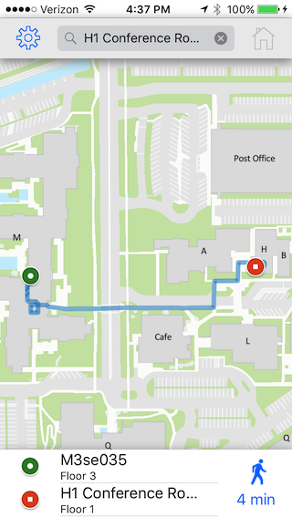

```csharp
// get the route from the results
var newRoute = this.Route.Routes.FirstOrDefault();

// create a picture marker symbol for start pin
var uiImageStartPin = UIImage.FromBundle("StartCircle");
var startPin = this.ImageToByteArray(uiImageStartPin);
var startMarker = new PictureMarkerSymbol(new RuntimeImage(startPin));

// create a picture marker symbol for end pin
var uiImageEndPin = UIImage.FromBundle("EndCircle");
var endPin = this.ImageToByteArray(uiImageEndPin);
var endMarker = new PictureMarkerSymbol(new RuntimeImage(endPin));

// create a graphic to represent the route
var routeSymbol = new SimpleLineSymbol();
routeSymbol.Width = 5;
routeSymbol.Style = SimpleLineSymbolStyle.Solid;
routeSymbol.Color = System.Drawing.Color.FromArgb(127, 18, 121, 193);

var routeGraphic = new Graphic(newRoute.RouteGeometry, routeSymbol);

// Add graphics to overlay
this.MapView.GraphicsOverlays["RouteGraphicsOverlay"].Graphics.Clear();
this.MapView.GraphicsOverlays["RouteGraphicsOverlay"].Graphics.Add(routeGraphic);
this.MapView.GraphicsOverlays["RouteGraphicsOverlay"].Graphics.Add(startGraphic);
this.MapView.GraphicsOverlays["RouteGraphicsOverlay"].Graphics.Add(endGraphic);

// Pan to the new route
await this.MapView.SetViewpointGeometryAsync(newRoute.RouteGeometry, 30);
```

Zooming, panning and switching floors are enabled during routing, and so is searching or moving to user's Home location.

|Route floor 1|Route floor 3|
|---	|---	|
|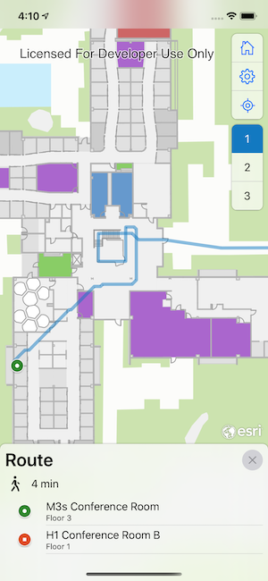|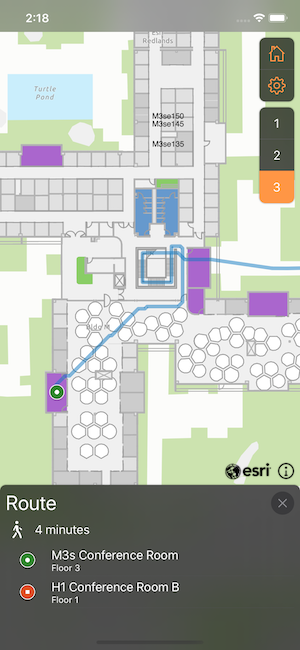|

To clear the Route, simply tap on the map and select the Clear Route option.

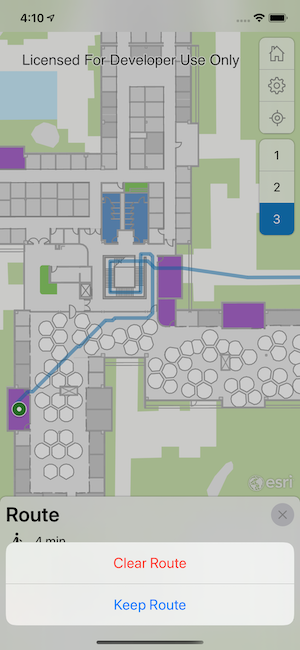

### Using location services

The app is written to allow using device location for tracking. However, this should be used with caution, as it does not work properly indoors. There are several options available for indoor positioning devices, and developers should to do their research to find the best option for their needs.

```csharp
if (AppSettings.CurrentSettings.IsLocationServicesEnabled == true)
{
    this.MapView.LocationDisplay.IsEnabled = true;
    this.MapView.LocationDisplay.AutoPanMode = LocationDisplayAutoPanMode.Recenter;
    this.MapView.LocationDisplay.InitialZoomScale = 150;
}
```

## Adaptive layout

The iOS UI for Indoor Routing has full support for iPad, iPad multitasking, and iPhone, including support for devices with and without notches.

iPhone SE (2016):

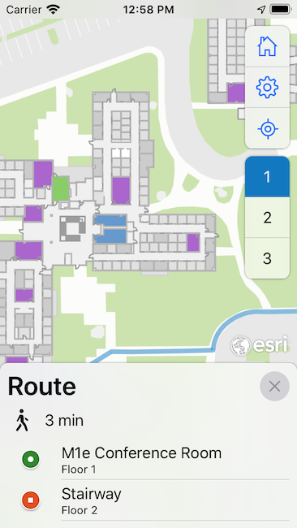

iPhone 11 Pro Max:

| Portrait | Landscape |
|-----------|----------|
| 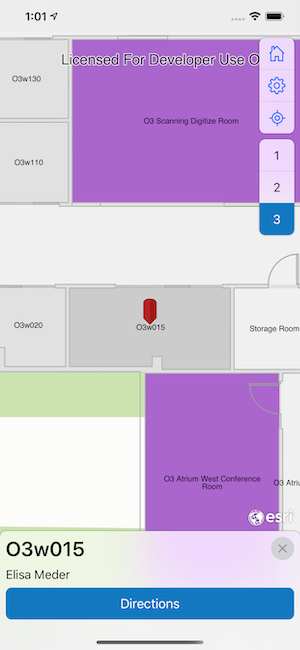 | 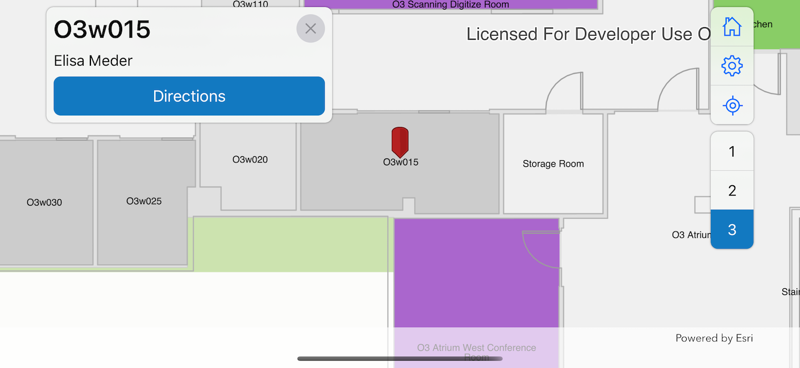 |

iPad (2019):

| Full width | 1/2 width | 1/3 width |
|------------|-----------|-----------|
|  | 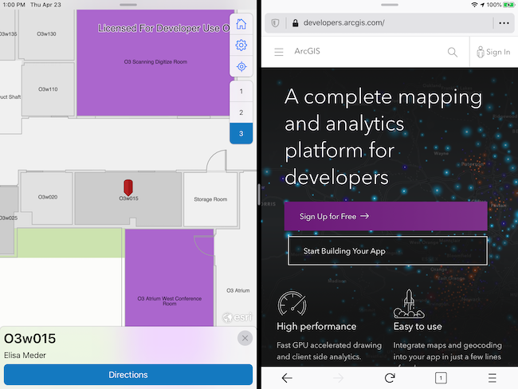 | 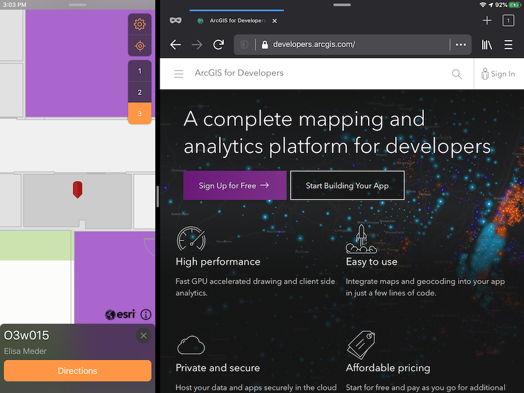 |

## Customize app appearance

To make it easier to update the visual appearance of the app, many values related to the UI are configured in a static `ApplicationTheme` class. You can edit values in that class to update the entire app in a uniform way.

```cs
public static class ApplicationTheme
{
    public static nint Margin;
    public static UIColor BackgroundColor;
    public static UIColor ForegroundColor;
    public static UIColor SeparatorColor;
    public static UIBlurEffect PanelBackgroundMaterial;
    public static nint SideWidgetWidth;
    public static nint FloorWidthMaxHeight;
    public static nint HandlebarThickness;
    public static nint HandlebarLength;
    public static nint HandlebarCornerRadius;
    public static nint CornerRadius;
    public static UIColor ActionBackgroundColor;
    public static UIColor ActionForegroundColor;
    public static UIColor SelectionBackgroundColor;
    public static UIColor SelectionForegroundColor;
    public static UIColor PrimaryLabelColor;
    public static UIColor SecondaryLabelColor;
    // Accessory button is a light/dark responsive color defined in the asset catalog
    public static UIColor AccessoryButtonColor;
    public static nint ActionButtonHeight;
    public static UIFont HeaderFont;

    static ApplicationTheme()
    {
        Margin = 8;
        SideWidgetWidth = 48;
        FloorWidthMaxHeight = 240;
        HandlebarThickness = 4;
        HandlebarLength = 48;
        HandlebarCornerRadius = 2;
        CornerRadius = 8;

        // Accessory button is a light/dark responsive color defined in the asset catalog
        AccessoryButtonColor = UIColor.FromName("AccessoryButtonColor");
        ActionBackgroundColor = AccessoryButtonColor;
        ActionForegroundColor = UIColor.White;
        SelectionBackgroundColor = ActionBackgroundColor;
        SelectionForegroundColor = ActionForegroundColor;

        ActionButtonHeight = 44;
        HeaderFont = UIFont.PreferredTitle1;

        BackgroundColor = UIColor.SystemBackgroundColor;
        ForegroundColor = UIColor.LabelColor;
        SeparatorColor = UIColor.SystemGray2Color;
        PanelBackgroundMaterial = UIBlurEffect.FromStyle(UIBlurEffectStyle.SystemMaterial);
        PrimaryLabelColor = UIColor.LabelColor;
        SecondaryLabelColor = UIColor.SecondaryLabelColor;
    }
}
```

## Update assets

All icons for the app are defined in the asset catalog. The asset catalog is already populated with calcite icons for most entries. You can supply new assets (keeping the name the same) to use them in the app without any code changes.
